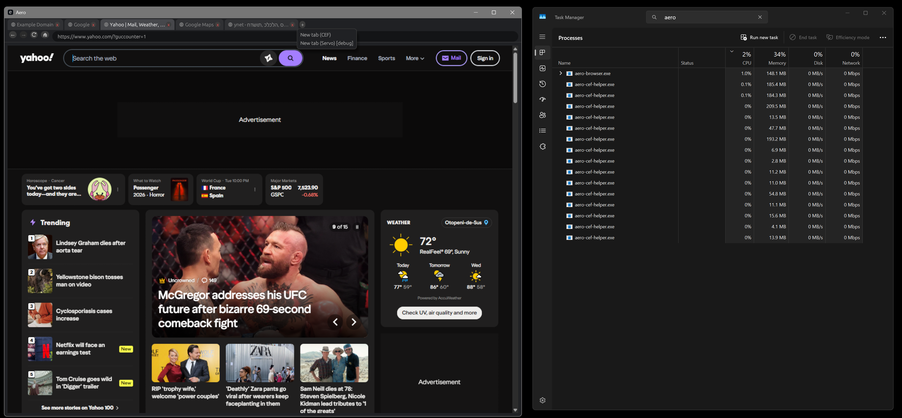

# Aero

## A privacy-first browser experiment built with Rust, Servo, CEF, and AI-assisted engineering

Aero is an experimental browser that decouples browser functionality from the rendering engine.

Whether running on Servo or CEF, the browser applies the same request interception, filtering, DNS resolution, and security policies through a shared engine-independent infrastructure.

The goal is not to create another Chromium-based browser, but to explore a cleaner and more maintainable approach to browser development with privacy-first principles in mind!

One browser shell. Multiple rendering engines. One consistent security model.
---

## Vision

Modern browsers are powerful, but they are also extremely complex.

Aero explores a different direction:

- Native Rust core
- Modular browser architecture
- Replaceable rendering engines
- Privacy-first foundations
- Local-first user data ownership
- Secure-by-design components

---

## Architecture

Aero uses an engine abstraction layer that separates the browser shell from the rendering engine.

```text
             Aero Browser
                  |
          Engine Trait API
                  |
      +-----------+-----------+
      |                       |
 Servo Engine            CEF Engine
 (Rust native)       (Chromium based)
```

This design allows Aero to support multiple rendering engines without rewriting the browser core.

### Network privacy layer

Every page request passes through two independent fences, shared by both engines:

```text
                Page request
                     |
          Request Interceptor          <- first fence
       (ad blocking + security
        blocklist, in microseconds)
                     |
        Local Filtering Proxy          <- second fence
      (in-process, loopback only,
        never terminates TLS)
                     |
          DNS over HTTPS resolver
      (blocked domains never resolve,
       no plaintext DNS by construction)
                     |
                  Network
```

Neither engine performs its own DNS: both are pointed at one in-process loopback proxy backed by Aero's own DNS-over-HTTPS resolver, so a malicious domain is refused before its name is ever looked up — and both engines get exactly the same guarantee.

---

## Core Principles

### Privacy by design

Aero is designed around:

- Local-first storage
- Encrypted user data
- User-controlled synchronization
- Minimal external dependencies

### Modular architecture

The project separates:

- Browser shell
- Rendering engines
- Network layer
- Storage layer
- Security layer
- Synchronization layer
- User interface

### Explicit engineering workflow

Development is organized through a structured, AI-assisted workflow that keeps context focused and predictable.

---

## Development Workflow

Aero uses a phase-based workflow:

```text
plan/
├── open/
├── wip/
└── closed/
```

Only the current work-in-progress phase is actively processed.

Each phase contains:

- clear objectives
- task definitions
- completion criteria
- execution rules

This avoids loading unnecessary project information and keeps development focused on the current goal.

---

## Roadmap

### Phase 0 — Dual Skeleton - DONE

Goal:

- Rust workspace - DONE
- Engine abstraction - DONE
- Servo first render - DONE
- CEF first render - DONE
- Basic browser tabs - DONE



### Phase 1 — Privacy Layer - DONE

Goal:

- Request interception - DONE
- Ad blocking (EasyList / EasyPrivacy, auto-refreshed) - DONE
- Security filtering (phishing/malware blocklists with safe override) - DONE
- DNS over HTTPS through a local in-process filtering proxy - DONE
- Engine conformance suite (Servo ↔ CEF parity report)

### Phase 1b — Navigation Controls - DONE

Goal:

- Engine navigation - DONE
- Navigation toolbar - DONE

### Phase 2 — Local Data Platform - DONE

Goal:

- Storage layer - DONE
- Encryption - DONE
- Session vault - DONE
- Restore system - DONE  

### Phase 3 — Synchronization

Goal:

- Device pairing
- Secure communication
- Cross-device synchronization

### Phase 4 — User Experience

Goal:

- Themes
- Tab management
- Split view
- Developer tools

### Phase 5 — Operations

Goal:

- Migration tools
- Production hardening

---

## Technology Stack

| Component | Technology |
| --- | --- |
| Language | Rust |
| Rendering engines | Servo + CEF |
| Build system | Cargo |
| CI | GitHub Actions |
| Documentation | Markdown |

---

## Project Status

🚧 Early development

Aero is currently in the foundation phase.

The project explores:

- browser architecture
- Rust application design
- privacy-focused computing
- AI-assisted software engineering

---

## Disclaimer

Aero is an experimental project.

It is a research and learning project focused on exploring alternative approaches to building modern browser software.

---

## License

TBD
